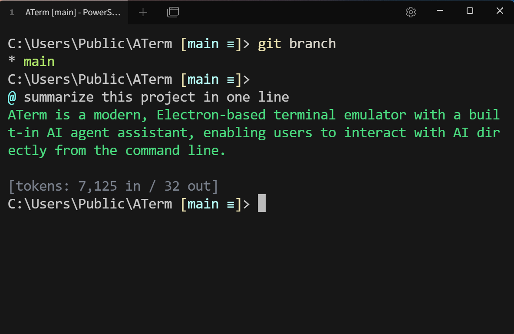
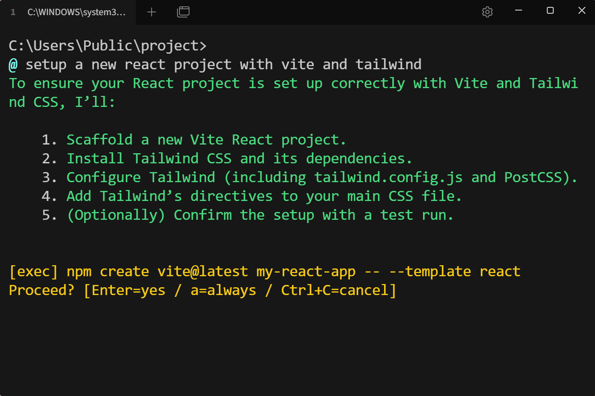

# ATerm

> *I vibe code with AI all day, but honestly? I'm tired of switching between my terminal and a coding CLI. Sometimes I just want to `cd` somewhere myself without the AI doing it for me. Sometimes I just want to ask a quick question without opening a whole new session. So I took inspiration from coding CLI agents and built a terminal with the same AI agent capabilities baked in. Right there when you need it, out of the way when you don't.*

ATerm.

AI Terminal. Agentic Terminal. AT Terminal. A Terminal.

A modern terminal with a built-in AI agent assistant.
Claude Code, Codex, Copilot CLI — built right into your terminal.
Type `@` and talk to AI directly from your command line.

*Talk to AI directly from your command line*


*AI agent that executes commands, edits files, and manages tasks for you*


## Features

- **Built-in AI Agent** — Type `@` to talk to AI directly from your command line. Execute commands, edit files, search the web, and manage tasks through natural language.
- **Modern Terminal** — GPU-accelerated rendering, ligature support, image display, and tabs.
- **SSH & Connections** — Native SSH client powered by Rust, serial port, telnet, and socket connections.
- **Cross-Platform** — Native apps for Windows, macOS, and Linux.
- **Secure & Private** — API keys stay local. Supports any OpenAI-compatible endpoint.
- **Extensible** — Modular plugin architecture with color schemes, shell integrations, and more.

## Development

### Prerequisites

- Node.js
- Yarn 4 (configured via `packageManager` in `package.json`)

### Install dependencies

```bash
yarn install
```

### Build

```bash
yarn build
```

### Start dev

Start webpack watch mode and Electron in two separate terminals:

```bash
# Terminal 1 - webpack watch mode
yarn watch

# Terminal 2 - start Electron app
yarn start
```

## License

MIT - see [LICENSE](LICENSE) for details.

Based on [Tabby](https://github.com/Eugeny/tabby) by Eugeny and contributors.
